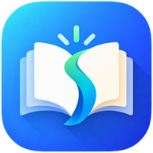

<p align="center">
  
</p>

<h1 align="center">Spinecast</h1>

<p align="center">A private EPUB library and reader, hosted entirely on Cloudflare.</p>

<p align="center">
  <a href="README.vi.md">Tiếng Việt</a> ·
  <a href="docs/DEVELOPMENT.md">Development and deployment</a>
</p>

---

Spinecast is an EPUB library and reader for a small invited group. Each member uploads their own books, reads them in the browser on phone or desktop, and keeps reading position, bookmarks, highlights and reading stats in sync with a KOReader or CrossPoint device through an external crosspoint-sync server. Every member's library is also published as an OPDS catalog, so that same device can browse and download the books directly.

The whole application is one Cloudflare Worker: no server to keep alive, and no bandwidth bill for the book files.

## Main features

**Accounts**
- Invite only. An admin mints codes under Administration › Invites; a code lasts seven days, can be revoked while unused, and the list shows which account redeemed it.
- Sign in with email and password, or with a **passkey** (Face ID, Touch ID, a security key) and type nothing at all. Passwords are not replaced; they remain the recovery path.
- Change your own password under Settings › Account. The current one is asked for first, and the same form can sign every other device out.
- No self-service reset and no email is ever sent. An admin issues a single-use link instead, good for 24 hours and shown once; using it ends every session the account had and signs you in on the spot.
- Every browser that logs in becomes its own device, listed and renameable under Settings › Devices. Remove one and the session it minted stops working on its next request.

**Books and reader**
- Upload `.epub` files up to 100 MB; metadata and cover art are extracted on the way in.
- Grid or list view, search by title or author, sort by recently read, title, author or date added. Select mode shares, unshares or deletes in bulk.
- Reader built on foliate-js: paginated or scrolled, adjustable font size, line height, margins, typeface and theme (light / paper / dark), table of contents, in-book search.
- Highlights in four colours with notes, plus bookmarks.
- Two accounts that upload the same file share one object in R2. It is reference counted, so a delete only frees the bytes once the last book pointing at them is gone.

**Sync with an e-reader**
- Reading progress travels both ways through crosspoint-sync, carrying KOReader xpath positions so the web reader and the device land on the same paragraph.
- Bookmarks and highlights use delta sync with tombstones, so a deletion in one place is a deletion everywhere.
- Both KOReader document hashes (partial-binary and filename) are computed at upload, so the device and the web agree on which book is which.
- Each user configures their own crosspoint-sync server (URL, username, password) from Settings after logging in. **Spinecast is a client of that server; it does not implement the sync API itself.**

**Reading stats**
- Time read, sessions, pages turned, books finished, consecutive-day streak.
- A twelve-month calendar at one cell per day, plus distribution by time of day and by day of week.
- The timezone is taken from the browser once and then stored on the account, so "today" does not shift when you travel.

**OPDS in both directions**
- *Serving*: two catalogs per user, a private one holding every book and a public one holding only what you chose to share, each behind its own token.
- *Consuming*: the Sources tab saves external OPDS catalogs, browses them live and imports books into your own library.
- Tokens are stored encrypted rather than hashed, so Settings › Share via OPDS can show one again later instead of making you regenerate it. The public catalog also copies a share link that opens the recipient's Sources tab with the URL and token already filled in.

**Administration**
- Overview: how many users, books and stored files exist and how many bytes they hold, plus orphans - a file row with no book, or an R2 object with no row. Cleanup rechecks each candidate immediately before deleting it, so an upload racing the scan is not destroyed.
- Users: change role, lock and unlock, issue a reset link, or delete the account with every book it owns. Deleting asks for the exact email typed back, and role, lock and delete all refuse to act on your own account. Locking bumps the account's session epoch, so a locked user is out everywhere at once.
- A user's own page lists their devices and passkeys and revokes either one. A revoked device is signed out on its next request, the one you are sitting at included.
- Books: a storage view - filename, owner, size, whether that file is shared with another account, date added, fifty rows at a time. Titles are deliberately absent; this page is for finding what takes up space, not for reading over anyone's shoulder.

**Other**
- Vietnamese and English UI, following the browser language on first visit and then stored on the account.
- Installable as a PWA. The app shell works offline, but **reading still needs a connection** - offline reading is not implemented.

## Some features in detail

<details>
<summary><b>OPDS: using your own catalog from an e-reader</b></summary>

Each user has two catalogs behind HTTP Basic Auth. The username is ignored; the password is a token created under Settings › Share via OPDS:

- `https://<host>/o/<slug>/l` - every book you own
- `https://<host>/o/<slug>/p` - only books switched to "Share to shared library"

The slug is six characters so the whole URL can be typed on an e-reader keyboard. The older `https://<host>/opds/<userId>/<scope>` form still works, so a reader configured before this keeps running.

In KOReader: File manager › Search › OPDS catalog › add, paste the URL, any username, the token as the password. Downloads are the original files, so KOReader's document hashes match what Spinecast stored at upload and crosspoint-sync progress lines up exactly.

Routes under a catalog: `/` (navigation), `/all`, `/recent`, `/authors`, `/authors/books?author=`, `/search?q=`, `/opensearch.xml`, `/books/<id>.epub`, `/books/<id>/cover`. Fifty entries per page.
</details>

<details>
<summary><b>OPDS: adding an external source</b></summary>

The Sources tab saves OPDS catalogs. Add one with its catalog URL plus a username and password if it needs them; the URL is probed once on save, so a wrong address or password fails immediately. Browsing walks the feed live: nothing is cached and nothing is prefetched. "Add" downloads the file the catalog serves, byte for byte, so the KOReader hashes match and crosspoint-sync progress lines up exactly as it does for an uploaded book. A book already downloaded from that catalog shows "In library" instead of a download button.

Cover art travels through the same proxy and is re-served from Spinecast's own origin. Only `image/jpeg`, `image/png`, `image/gif` and `image/webp` are accepted; an SVG cover is refused deliberately, since serving SVG from your own origin is an XSS vector.

Credentials are dropped on any redirect that leaves the catalog's origin. A catalog saved as `http://` that redirects to `https://` and needs credentials fails at save time, not because the password is wrong but because it never reaches the `https://` origin carrying it. Save the `https://` URL directly.

Only OPDS 1.2 (Atom XML) with optional HTTP Basic auth is supported. Catalogs on `localhost` or a private IP range are refused, the same restriction the sync server carries, so a Calibre-web on the home LAN cannot be added; Spinecast's own catalogs are allowed.
</details>

<details>
<summary><b>Passkeys</b></summary>

Add one under Settings › Passkeys. Adding asks for the account password again: a passkey is a permanent extra key to the account, so a borrowed session must not be enough to mint one. Once a passkey exists, the login screen offers "Sign in with a passkey" and signs in with no email and no password typed.

**A passkey is bound to the hostname it was created on.** The RP ID comes from the request, so one enrolled against `localhost` will not work on the production hostname and vice versa. That is WebAuthn behaving as specified.

Only ES256 authenticators with discoverable credentials are used, both platform and cross-platform. There is no attestation verification and no certificate chain.
</details>

## Architecture

One Cloudflare Worker serves all three surfaces: a Hono JSON API under `/api/*`, the OPDS catalogs under `/o/*` (and the older `/opds/*`), and the React SPA through Static Assets. Admin-only routes live under `/api/admin/*` behind a role check. D1 holds users, books and sync state; R2 holds the EPUB files and covers; KV holds sessions, WebAuthn challenges and rate-limit counters. Every call to crosspoint-sync goes through the Worker; the browser never talks to it directly.

```
src/worker/      Hono app: routes, middleware, services, sync client, opds
src/web/         React SPA: pages, reader, hooks, components
src/shared/      DTOs and the Position type shared by both sides
migrations/      D1 SQL migrations
docs/design/     UI artboards, generated by gen.mjs
vendor/          foliate-js (git submodule)
```

## Why Cloudflare

Because compute, SQL, object storage and KV all sit on the free tier, which is enough for a small group at no cost, with no server to keep alive and no egress fee on the book downloads. If you want something closer to production (more users, larger files, no daily quotas), the Workers Paid plan lifts exactly the limits that matter and storage stays cheap.

The limits that actually bear on Spinecast, from developers.cloudflare.com on 2026-09-04:

| Resource | Free | Workers Paid |
|---|---|---|
| Request body (max upload) | 100 MB | 100 MB (Business: 200 MB, Enterprise: up to 5 GB) |
| Worker memory | 128 MB | 128 MB |
| CPU time per request | 10 ms | 30 s by default, up to 5 min |
| D1 database size | 500 MB (5 GB per account) | 10 GB (1 TB per account) |
| R2 storage | 10 GB-month free, then $0.015/GB-month | same |
| R2 operations | 1M writes, 10M reads per month free | $4.50 per M writes, $0.36 per M reads |
| R2 egress | free | free |
| KV writes | 1,000 per day | unlimited |
| KV reads | 100,000 per day | unlimited |
| KV value size | 25 MiB | 25 MiB |

What that means in practice:

- **The 100 MB cap on a book is the platform's request body limit, not an app decision.** Larger files need a Business account, or direct-to-R2 uploads with presigned URLs.
- **On the free tier the 10 ms CPU budget is tight** for login (PBKDF2 at 100,000 iterations) and for parsing a large EPUB at upload. If those requests start failing with CPU limit errors, the fix is the Paid plan, not a weaker hash.
- **Every login, failed login and failed OPDS token attempt is one KV write.** A thousand a day is comfortable for a handful of people and wrong for a public site.
- **10 GB of R2 holds roughly 3,000 to 10,000 EPUBs**, depending on how image-heavy they are. D1 only stores metadata and sync state, so 500 MB is far more than enough.

## Further documentation

- [Development and deployment](docs/DEVELOPMENT.md) - running locally, tests, Cloudflare setup, migrations, deploy.
